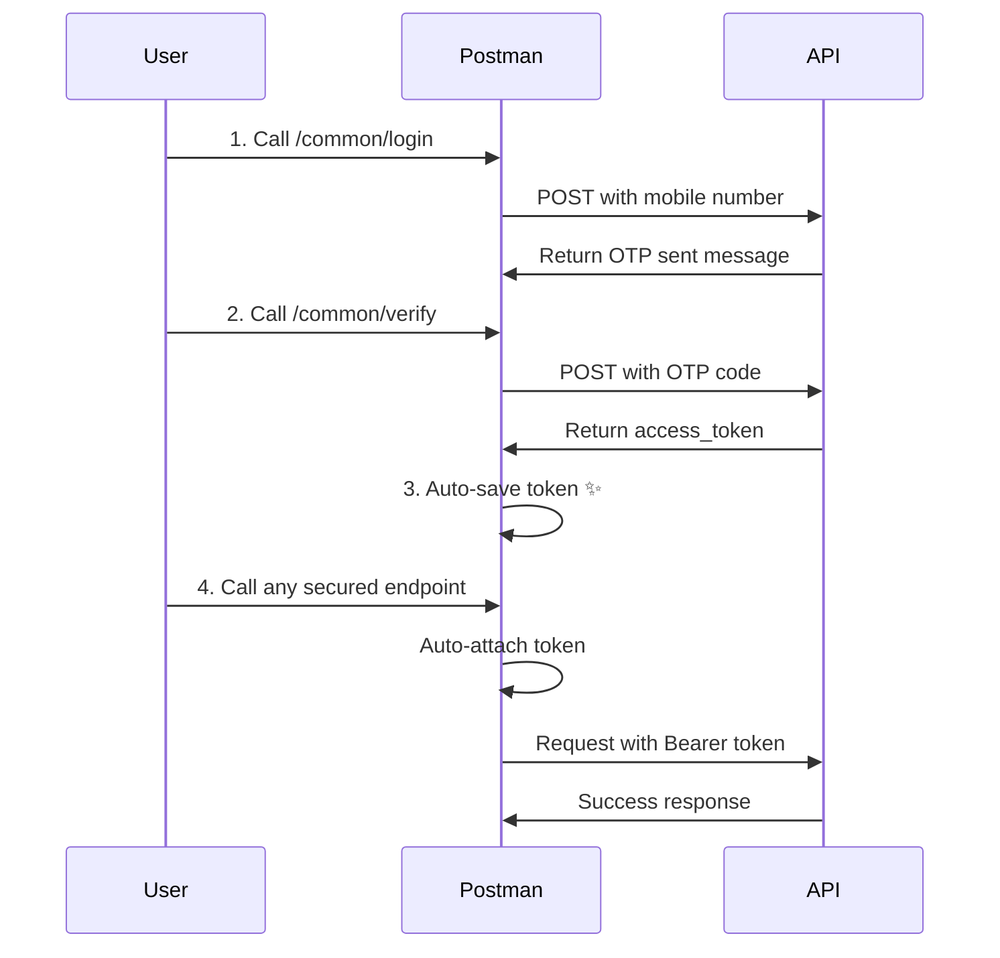

# OpenAPI to Postman Converter

A powerful Python tool that converts FastAPI OpenAPI/Swagger specifications into Postman Collections with automatic bearer token management.

## Features

✅ **Automatic Token Management** - Login once, token auto-saved and used everywhere  
✅ **Environment Variables** - Pre-configured with base_url, access_token, user_id  
✅ **Smart Scripts** - Pre-request validation and test scripts for token handling  
✅ **Full Conversion** - All endpoints, parameters, request bodies, and authentication  
✅ **Organized Structure** - Endpoints grouped by tags (Admin, Common, Teacher, Student)  
✅ **Ready to Import** - Direct import into Postman, no manual setup needed

## Installation

1. **Install Python 3.7+** (if not already installed)

2. **Install dependencies:**
   ```bash
   pip install -r requirements.txt
   ```

## Usage

### Step 1: Configure

Edit `config.json` with your API details:

```json
{
  "openapi_url": "http://170.187.250.145/openapi.json",
  "base_url": "http://170.187.250.145",
  "output_collection": "postman_collection.json",
  "output_environment": "postman_environment.json"
}
```

**Configuration Options:**
- `openapi_url` - URL to your OpenAPI/Swagger JSON specification
- `base_url` - Base URL of your API (used in all requests)
- `output_collection` - Filename for the Postman collection output
- `output_environment` - Filename for the Postman environment output

### Step 2: Run Conversion

```bash
python converter.py
```

You should see output like this:

```
======================================================================
OpenAPI to Postman Converter
======================================================================

Fetching OpenAPI spec from http://170.187.250.145/openapi.json...
✓ Successfully fetched: SYNCKARO_API v0.1.0

Converting to Postman collection format...
✓ Converted 45 endpoints into 4 groups

✓ Generated environment: SYNCKARO_API Environment

✓ Collection saved: postman_collection.json
✓ Environment saved: postman_environment.json

======================================================================
✓ Conversion Complete!
======================================================================
```

### Step 3: Import to Postman

1. **Open Postman**
2. Click **Import** button (top left)
3. **Select Files** → Choose both generated JSON files:
   - `postman_collection.json`
   - `postman_environment.json`
4. Click **Import**
5. **Select Environment** from the dropdown (top right)

### Step 4: Test Authentication

1. Navigate to **Common → Login** request
2. Send request with mobile number to get OTP
3. Navigate to **Common → Verify** request
4. Send request with OTP code
5. **Token automatically saved!** ✨

### Step 5: Use Other Endpoints

All secured endpoints will now automatically use your saved token. No need to copy-paste!

## How Auto-Token Management Works

### Pre-Request Script
Runs **before** every request:
- Checks if `access_token` exists
- Validates token hasn't expired
- Logs warnings if token missing or expired

### Test Script
Runs **after** every successful response:
- Automatically extracts `access_token` from response
- Saves token to environment variable
- Sets expiry timestamp (24 hours default)
- Also saves `user_id` if present

### Where Tokens Are Saved

The following response patterns are automatically detected:

```json
// Pattern 1: Token at root level
{
  "access_token": "eyJhbGc...",
  "user_id": 123
}

// Pattern 2: Token in data object
{
  "data": {
    "access_token": "eyJhbGc...",
    "user_id": 123
  }
}
```

## Environment Variables

The generated environment includes these variables:

| Variable | Description | Auto-Populated |
|----------|-------------|----------------|
| `base_url` | API base URL | ✅ Yes (from config) |
| `access_token` | JWT authentication token | ✅ Yes (on login) |
| `token_expiry` | Token expiration timestamp | ✅ Yes (on login) |
| `user_id` | Current user ID | ✅ Yes (if in response) |

## Collection Structure

Endpoints are automatically organized by OpenAPI tags:

```
📁 SYNCKARO_API
├── 📂 Common
│   ├── POST /common/signup
│   ├── POST /common/login
│   ├── POST /common/verify
│   ├── POST /common/logout
│   ├── POST /common/profile/get
│   └── ...
├── 📂 Admin
│   ├── POST /admin/home
│   ├── POST /admin/teacher/list
│   └── ...
├── 📂 Teacher
│   └── ...
└── 📂 Student
    └── ...
```

## Request Examples

All requests include example request bodies generated from OpenAPI schemas:

```json
{
  "name": "<name>",
  "mobile": "<mobile>",
  "type": "teacher"
}
```

## Troubleshooting

### Error: "No module named 'requests'"
```bash
pip install requests
```

### Error: "Configuration file not found"
Make sure `config.json` exists in the same directory as `converter.py`

### Token not being saved
- Check Postman Console (View → Show Postman Console)
- Verify the response contains `access_token` field
- Ensure you've selected the correct environment

### Endpoints showing "unauthorized"
- Check that token was saved (look in environment variables)
- Verify token hasn't expired (24 hour default)
- Re-run login → verify flow to get new token

## API Authentication Flow



## Advanced Usage

### Custom Token Expiry

Modify the test script in your Postman collection to change token expiry duration:

```javascript
// Default: 24 hours
const expiryTime = Date.now() + (24 * 60 * 60 * 1000);

// Change to 1 hour
const expiryTime = Date.now() + (1 * 60 * 60 * 1000);
```

### Multiple Environments

Generate collections for different environments (dev, staging, prod):

1. Update `config.json` with different URLs
2. Run converter again
3. Import all environments into Postman
4. Switch between them using environment dropdown

### Batch Conversion

Convert multiple APIs:

```bash
# Edit config.json for API 1
python converter.py

# Edit config.json for API 2  
python converter.py
```

## Technical Details

- **Output Format:** Postman Collection v2.1
- **Authentication:** Bearer Token (JWT)
- **Script Language:** JavaScript (Postman sandbox)
- **Python Version:** 3.7+
- **Dependencies:** requests==2.31.0

## File Structure

```
📁 API to POSTMAN/
├── 📄 converter.py              # Main conversion script
├── 📄 config.json               # Configuration file (edit this!)
├── 📄 requirements.txt          # Python dependencies
├── 📄 README.md                 # This file
├── 📄 postman_collection.json   # Generated collection (output)
└── 📄 postman_environment.json  # Generated environment (output)
```

## Support

For issues or questions:
1. Check the Troubleshooting section above
2. Verify your OpenAPI JSON is valid
3. Check Postman Console for script errors

## License

Free to use and modify as needed.

---

**Made with ❤️ for easy API testing**

